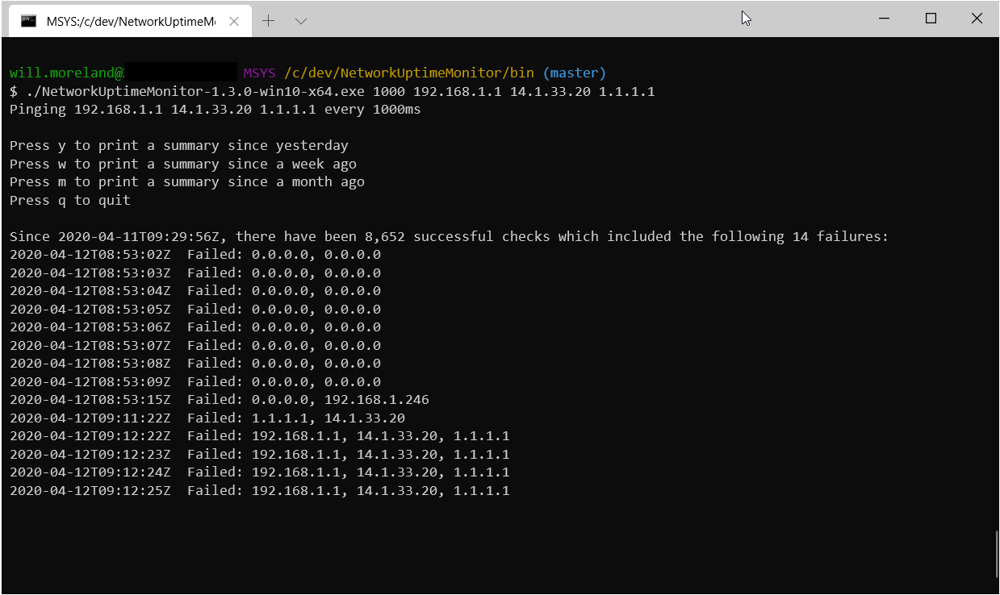

# Network Uptime Monitor

This program will ping IP addresses at a given interval and store the results in a SQLite database. It will also display basic information about the results. I use this to see when my network connection goes down, and to try troubleshoot. For example, by pinging an IP on my network, an IP my ISP owns, and an IP on the internet, I can tell where my network failed.

## Getting started 💡
1. Download a release from the [releases page](https://github.com/un1r8okq/NetworkUptimeMonitor/releases) or [compile it yourself](#Compiling)
1. Run it like `NetworkUptimeMonitor.exe 1000 1.1.1.1 8.8.8.8` to check 1.1.1.1 and 8.8.8.8 every 1000 milliseconds. The program will use the database in `./Data/UptimeSqliteDatabase.db` or create one if it doesn't already exist.

## Reading into the data 🔍
There is more data being stored than what is being surfaced in the program, and it can be easily accessed by [downloading an SQLite client](https://www.sqlite.org/download.html) and executing some SQL on the database file using the tables below for reference.

## Compiling 🔨
1. Install the [.NET 6 SDK](https://dotnet.microsoft.com/en-us/download/dotnet/6.0)
1. Have git installed
1. Clone this repository
1. Find the [runtime identifier](https://docs.microsoft.com/en-us/dotnet/core/rid-catalog) for your environment. For example, if you're wanting to run this on a 64 bit version of Windows, use `win-64`.
1. Run this command from within the repository `dotnet publish -r <RID> -c Release /p:PublishSingleFile=true /p:PublishTrimmed=true` replacing `<RID>` with the runtime identifier from the above step
1. Check the output of the above command to find your compiled executable!

## Database tables 📚
This program uses the following tables in `./NetworkUptimeMonitor/Data/UptimeSqliteDatabase.db`:

### uptime_results
| Column           | DataType | Description |
| ---------------- | -------- | ----------- |
| uptime_result_id | INTEGER  | A unique identifier for an uptime result. I chose an integer for the primary key because I don't see the need to ever really shard this database, it uses less space, is more performant, and [is a unsigned 64 bit integer behind the scenes](https://www.sqlitetutorial.net/sqlite-primary-key/). That's nine quintillion possible values ,so we'd habe to write 3 three billion rows per second to run out in 100 years. |
| date_time_utc    | TEXT     | An ISO8601 representation of a UTC timestamp e.g. 2020-04-12T03:52:00Z |
| was_up           | INTEGER  | This is a denormalised binary value that indicates if any of the ping requests were unsuccessful. It is denormalised to improve performance so that you don't have to query every ping request to see if an uptime result was down. |

Index: `idx_uptime_results_was_up_date_time_utc` on `was_up` and `date_time_utc`. This exists because the most common query is on both `date_time_utc` and `was_up`.

### ping_results
| Column            | DataType | Description                                                                            |
| ----------------- | -------- | -------------------------------------------------------------------------------------- |
| ping_result_id    | INTEGER  | A unique identifier for a ping result.                                                 |
| uptime_result_id  | INTEGER  | A foreign key reference to the uptime result that this ping request belongs to         |
| date_time_utc     | TEXT     | An ISO8601 representation of the UTC timestamp from when the ping result was generated |
| target_ip_address | TEXT     | The IP address that had a ping request sent to it                                      |
| status            | INTEGER  | The integer representation of the [IPStatus Enum](https://docs.microsoft.com/en-us/dotnet/api/system.net.networkinformation.ipstatus?view=netframework-4.8) that shows the status of the ping result |
| round_trip_time   | INTEGER  | The RTT of the ping request in milliseconds                                            |

Index: `idx_ping_results_uptime_result_id` on `uptime_result_id`. This exists because the most common query is to pill all ping results for a given `uptime_result_id`.

## Contributing ❤
You'd be the first, but go ahead and open a PR! 🎉❤
